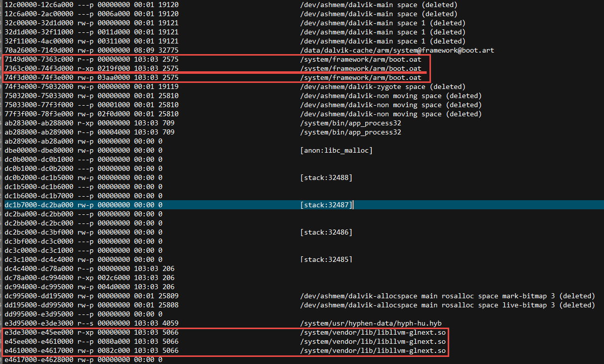

#Native Hook
By Howie.Hxu

#前言
熟悉windows编程的同学应该比较了解Hook技术，一般意义上都把Hook认为是钩子函数，这个比喻非常恰当。　　
在你完成某件事情之前通过钩子先勾出来，然后再丢回去（囧），让原本的流程继续走．．．  
抛开windows的环境，我们这边谈的Hook会更加广义一些，虽然也有那么点“钩子”函数的味道，但是更加倾向于Hack＆动态注入，有点黑客的味道。

#Hook的形式
在android的世界中，我们很自然的把世界分为java空间和native地盘。  

##java的世界：反射当道
对于java的世界来说，[反射（reflect）技术](http://baike.baidu.com/link?url=0h3Wlfu3g8E08uEGE4s7af8lJEvhEHdn0M92w7H9iuld8DRH2hWeI9yA5M-TN0Izqx5nmKZ8J1lDFob-K_NpzK)的存在，在runtime的时候我们可以获取到任意类的任意成员变量，调用任意的成员方法，几乎所有的一切都是明文昭告，世人皆知。

##native的世界：三国乱世
而对于native的世界，hook的难度比java层大不少。常规的hook会有**ELF GOT hook**和**inline hook**，以及**ptrace**。对于这三种hook手段，可以说是各有优劣。 

###ELF GOT hook
在了解GOT Hook之前建议先了解一下ELF文件格式的相关内容：[wiki](https://en.wikipedia.org/wiki/Executable_and_Linkable_Format)，[elf v1.2](https://refspecs.linuxbase.org/elf/elf.pdf)  
言归正传，鉴于ELF文件的特性：函数的调用会通过GOT（global offset table）查询相关地址，然后再做跳转。  
对于GOT查询而言，其实又是符号重定向的一种形式。  
因此hook的思路也就有了，通过修改GOT表中的跳转地址，让它跳转到我们指定的某个函数，然后....  
详细的demo做法可以参考：[基于Android的ELF PLT/GOT符号重定向过程及ELF Hook实现](http://blog.csdn.net/L173864930/article/details/40507359)  
代码的部分boyliang博主也有po出来：[AllHookInOne](https://github.com/boyliang/AllHookInOne.git)  
Demo的部分直接拿来用NDK编译，helloworld的部分跑到target上一切都顺风顺水。  
**But**  
Demo一切好，应用跑不起。  
在实际的操作里应用到android进程去做hook就产生了各种各样的问题，归纳一下就是两类：  
1. hook无效  
2. segment fault

####Hook无效
通过阅读boyliang的code，可以看到他只是针对libonehook.so做了GOT Hook
```c++
...... 
elfHook("libonehook.so", "strlen", (void *)my_strlen, (void **)&old_strlen);  
...... 
```

然后对于一个运行着的process来说，它可能会load进N多的so文件，而每一个so文件其实都是一个ELF文件。
> ELF文件有三种形式：  
>  1.可重定位的对象文件(Relocatable file)，也就是我们熟悉的那些.o文件，当然.a库也算（因为它是.o的集合）  
>  2.可执行的对象文件(Executable file)，linux下的可执行文件  
>  3.可被共享的对象文件(Shared object file)，动态链接库.so  

因此对于一个真正运行着的进程来说，光是hook了其中的某一条so那是远远不够的...  
所以这边就需要先遍历当前进程中的所有load进来的so & elf，挨个去hook。
>这边有一个问题，因为对于so来说是动态加载的，所以就有可能在某个时刻...该so并没有加载而在之后被加载..  




那么问题就来了，我们要如何去编译当前进程中有哪些elf & so呢？  
这一点如果对linux有所了解，就会很自然的想到/proc/self/maps文件，因为对于进程来说，所有可执行的代码其实都是被load到内存中的可执行段而已，因此，要查找它们就需要查看mmap，要查看自身的mmap，必看/proc/self/maps/  

maps文件中一般elf & so文件是三行连载一起的，获取到最低位置的地址后，即是elf & so加载的起始地址了，然后再根据elf文件的特性去parse即可。这一块东西boyliang的github上已经写的很清楚了，code在这边也不再多做罗列了。简单归纳如下：  
1 . 读取/proc/self/maps文件，找到对应so的起始地址：**openElfBySoname**，填充ElfHandle：   

```c++
	struct ElfHandle {
		void *base;
		size_t space_size;
		bool fromfile;
	};
````

2 . 分析memory中的elf数据，填充Elfinfo：**getElfInfoBySegmentView**   

```c++
	struct ElfInfo{
		const ElfHandle *handle;
	
		uint8_t *elf_base;
	
		Elf32_Ehdr *ehdr;
		Elf32_Phdr *phdr;
		Elf32_Shdr *shdr;
	
		Elf32_Dyn *dyn;
		Elf32_Word dynsz;
	
		Elf32_Sym *sym;
		Elf32_Word symsz;
	
		Elf32_Rel *relplt;
		Elf32_Word relpltsz;
		Elf32_Rel *reldyn;
		Elf32_Word reldynsz;
	
		uint32_t nbucket;
		uint32_t nchain;
	
		uint32_t *bucket;
		uint32_t *chain;
	
		const char *shstr;
		const char *symstr;
	};
```

3 . 通过要hook的函数name，找到对应的symbol index（此处symbol即需要hook的函数），**findSymByName**  
4 . 需要同吃三种类型的重定向**R\_ARM\_JUMP\_SLOT、R\_ARM\_ABS32和R\_ARM\_GLOB\_DAT**  
5 . 替换掉原先的地址，使用我们的替换之，注意boyliang保留了原来的函数指针，其主要目的是方便我们在自己的函数中调用它。

```c++
	static int replaceFunc(void *addr, void *replace_func, void **old_func){
		int res = 0;
	
		if(*(void **)addr == replace_func){
			printf("addr %p had been replace.\n", addr);
			goto fails;
		}
	
		if(!*old_func){
			*old_func = *(void **)addr;
		}
	
		if(modifyMemAccess((void *)addr, PROT_READ|PROT_WRITE)){
			printf("[-] modifymemAccess fails, error %s.\n", strerror(errno));
			res = 1;
			goto fails;
		}
	
		*(void **)addr = replace_func;
		clearCache(addr, getpagesize());
		printf("[+] old_func is %p, replace_func is %p, new_func %p.\n", *old_func, replace_func, *(uint32_t *)addr);
	
		fails:
		return res;
	}

	#define PAGE_START(addr) (~(getpagesize() - 1) & (addr))
	
	static int modifyMemAccess(void *addr, int prots){
		void *page_start_addr = (void *)PAGE_START((uint32_t)addr);
		printf("set = 0x%x\n",page_start_addr);
		return mprotect(page_start_addr, getpagesize(), prots);
	}
```

>这边需要注意的是调用了mprotect修改内存映射的读写权限，理论上在改为rw以后还要再改回去才好

###Segment Fault
其实这边就要依据具体问题具体分析了。  
数量掌握add2line工具以及objdump的使用，可以更快的帮助定位问题点。  
不过话说回来andoird目前对于coredump的处理已经很智能了，可以帮忙打印出指针的地址以及symbol name...

##inline hook
讲inline hook我的准备还不足，这边贴几篇文章吧  
首当其冲的是看雪论坛上的文章（这是一个致力于介绍移动端设备安全的社区，不过攻防本一体）  
[inline hook，作者：张jialin](http://bbs.pediy.com/showthread.php?t=188324)  
其次，这是一篇我觉得写的不错的文章，出生比较卑微“游戏安全实验室”  
[Android平台inline hook实现](http://gslab.qq.com/article-168-1.html)  
inline hook会牵扯到一些arm的汇编知识，还需要根据64 or 32bit做不同的处理。  
起步比较慢，但好处是相对elf got hook来说会更加彻底。（这里暂且丢个坑吧，以后有机会再做分析啦）


##ptrace
ptrace是一个非常好用的工具。  
关于ptrace的介绍，大家可以参考csdn的转帖：[ptrace运行原理及使用详解](http://blog.csdn.net/edonlii/article/details/8717029)  
当然，我更推荐大家直接看linux的文档：man ptrace。

###监听监视
ptrace的全称是process trace，顾名思义它提供了一种监听process的方式。
>印象中GDB好像就是ptrace的一种应用场景？

ptrace提供了一套现成的框架来监听process的system call。  
而system call则是所有api的基础之基础，可以说没有什么可以逃出system call的。  
所以hook的问题再次被解决了，那就是利用ptrace监听system call，从而在特定的时候做一些的猥琐事。

###偷开后门
ptrace在实际应用中并不是监听监视这么简单的，一般会用来偷开后门。这是怎么一回事呢？  
>假定我们现在有一个process A，在实际调用中，我想在它的程序上运行一个我提供的liba.so，其中的function F，打印“helloworld”  
>于是我先启动一个进程B，再它运行的时候用ptrace先attach到process A，再监听某个system call，例如open
>当process A进行file操作的时候，system call open就会被我的进程B所捕获。  
>捕获了之后呢，我们想办法通过调用process A的dlopen去装载liba.so

偷偷装载liba.so，还能比这样行为更大胆的吗？

>然后再利用dlsym去找到对应的function address...“helloworld”就横空出世了！

当然了，由于[ASLR](http://baike.baidu.com/link?url=pstG9s4ZVVdyKYcWu7cFSYpcnk3DpkxpciemdDR1objZkjnGIcMfIVJc9w-bbPxxD00h1G8fA2GbOCEPOjtFXK)的存在，我们并不能一眼就拿到dlopen（或其他function）的地址。  
但由于lib装载的地址连续性特性，通过遍历进程A和B的maps找到/system/bin/linker（android中dlopen是在linker中）的基地址  
再通过算出dlopen在B进程中的地址，两者相减得到offset-B-dlopen。  
继续依葫芦画瓢，通过A的mmap拿到linker的基地址，加上之前的offset-B-dlopen，便是dlopen在进程A中的地址了。
> Offset-A-dlopen - Base-A-liker = Offset-B-dlopen - Base-B-liker 

###open source demo
可以参考[七武器](https://github.com/zhengmin1989/TheSevenWeapons)  
其中离别钩这个目录就是ptrace的hook，非常简单好用易于理解（代码也不多）  
另外，还有另外一个open source：[arminject](https://github.com/evilsocket/arminject)  
顺便提一下，arminject中有其实分别用到了ptrace和elf got hook。 
 
我最终的elf got hook也是结合[arminject](https://github.com/evilsocket/arminject)和之前的boyliang的[AllHookInOne](https://github.com/boyliang/AllHookInOne.git)而成型的。
>如果有兴趣的话也可以看看arminject中对于python的那一段，可以吸收作为自己的本地脚本噢  
>arminject的脚本中主要做了push ，chmod，抓log，启动elf，基本上adb常用的一些命令都可以直接拿来用了  
>比写cmd裸脚本要好一些，而且是现成的


###缺陷与不足
这边的缺陷主要是自身的原因（囧）
首先是ptrace本身，因为process可以关闭ptrace，次奥。  
其次是system call的监听...跨进程...感觉效率会很低，而且受限与ptrace，一次读写的内容只能是一个字长（32bit or 64bit）  
再次是就算偷开了后门，如果仍旧是去做inline hook & got hook，那还不如直接在client进程启动的时候就做掉了。
> 其实当初ptrace hook的实现是最早跑通的。  
> 因为使用上确实很方便，不得不说linux提供了很多方便的工具给我们，关键就在于怎么用  
> 只是受限于应用场景，ptrace并不是最优选，所以搁置

#写在最后
其实hook的手段和做法应该还有很多，关键在于如何选择一套最适合当前应用场景的方案才是要点。  
elf got hook需要对elf文件格式有一定的了解，但是它无法彻底解决lazy load的问题。  
inline hook很彻底，但是又依赖于特定的平台，不熟悉arm汇编的话开发调试都会很累。  
ptrace的方法源自linux kernel，只是万一哪天process不让trace了，囧。

技术是不断进步的，希望借助大家的力量一起大开脑洞，越走越好，越飞越高。

